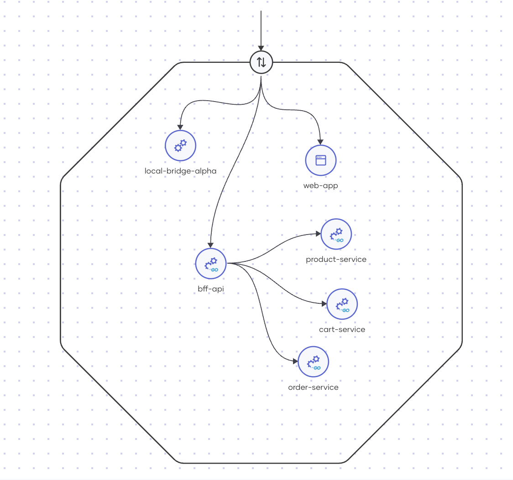

# CloudMart: Microservices E-commerce Application

CloudMart is a sample e-commerce application built using a microservices architecture, designed to demonstrate how multiple services can work together to create a complete shopping experience. The application allows users to browse products, add items to a cart, place orders, and view order history.

## System Architecture

CloudMart uses a microservices architecture with the following components:

### Frontend
- **Web App**: A React-based single-page application that provides the user interface for customers to browse products, manage their shopping cart, and place orders.

### Backend Services
- **BFF API (Backend for Frontend)**: An Express.js service that acts as the intermediary between the frontend and the microservices, handling API routing and orchestration.
- **Product Service**: A Go microservice responsible for managing product information and catalog browsing.
- **Cart Service**: A Go microservice that handles shopping cart operations (add, update, delete items).
- **Order Service**: A Go microservice for order processing, history, and status management.

## Technology Stack

### Frontend
- **React**: UI library for building the user interface
- **React Router**: For client-side routing
- **React Toastify**: For displaying notifications
- **Fetch API**: For making HTTP requests to backend services

### Backend
- **Node.js & Express**: For the BFF API layer
- **Go**: For the microservices
- **RESTful APIs**: For service communication
- **JSON**: Data interchange format

### Deployment
- **Choreo**: Cloud platform for hosting and managing the services
- **Docker**: Containerization of the services
- **OpenAPI**: API documentation and specification

## Component Details

### Web App
The frontend application provides the following features:
- Product browsing and search
- Shopping cart management with quantity controls
- Checkout process
- Order history viewing
- Order details with status tracking

### BFF API
The Backend for Frontend API:
- Aggregates data from multiple microservices
- Handles service orchestration
- Provides a unified API for the frontend
- Manages error handling and response formatting

### Product Service
Manages the product catalog with features:
- List all products
- Get product details
- Search products by name or category
- Filter products by category

### Cart Service
Handles shopping cart operations:
- Get current cart contents
- Add items to cart
- Update item quantities
- Remove items from cart
- Clear entire cart

### Order Service
Manages the order lifecycle:
- Create new orders from cart contents
- Get order history
- Get order details
- Update order status (pending, completed, cancelled)

